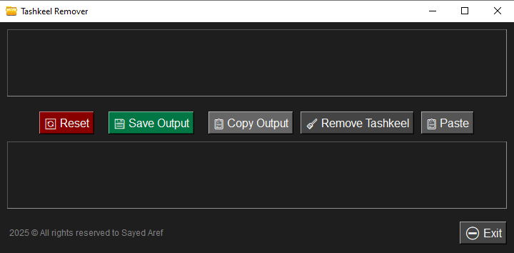

# Tashkeel Remover - Arabic Diacritics Cleaner 🧹

A simple desktop GUI tool built with **Python** and **Tkinter** to remove Arabic diacritics (Tashkeel) from text, with additional features like clipboard paste, output copying, saving to file, and more.



---

## 📦 Features
✅ Remove Arabic Tashkeel (diacritics)  
✅ Paste text from clipboard  
✅ Prevent English input (both paste and typing)  
✅ Copy output to clipboard  
✅ Save output to `.txt` file  
✅ Reset/Clear input and output fields  
✅ Dark-themed GUI  
✅ No console window in EXE version  
✅ Custom icon support

---

## 🎯 Usage
### 🔧 Requirements
- Python 3.7+
- Tkinter (built-in)
- No external libraries required

### ▶️ Run the app

```bash
python tashkeel_remover.py

📦 Create an EXE (Windows only)
pip install pyinstaller
pyinstaller --noconsole --onefile --icon=assets/icon.ico tashkeel_remover.py

📂 File Structure
css
Copy
Edit

tashkeel-remover/
│
├── assets/
│   └── icon.ico
│
├── tashkeel_remover.py
├── README.md
├── .gitignore
└── dist/

🙌 Author
Sayed Aref
📧 Contact via GitHub
